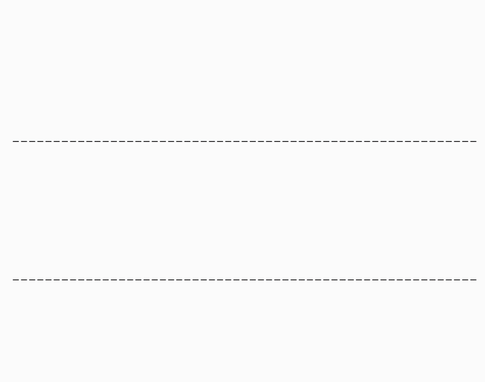

# ReSim

**Reliable World Simulation
for Autonomous Driving**

> [Jiazhi Yang](https://github.com/YTEP-ZHI), 
> [Kashyap Chitta](https://kashyap7x.github.io/), 
> [Shenyuan Gao](https://github.com/Little-Podi), 
> [Long Chen](https://long.ooo/), 
> [Yuqian Shao](https://meteorcollector.github.io/),
> [Xiaosong Jia](https://jiaxiaosong1002.github.io/),
> [Hongyang Li](https://lihongyang.info/),
> [Andreas Geiger](https://www.cvlibs.net/), 
> [Xiangyu Yue](https://xyue.io/), 
> [Li Chen](https://ilnehc.github.io/)
> 
>
> 📜 [[technical report](https://arxiv.org/abs/2506.09981)],
>  🎬 [[video demos](https://opendrivelab.com/ReSim)]
>
> :e-mail: Primary Contact: Jiazhi Yang (jzyang@link.cuhk.edu.hk)


<div id="top" align="center">
<p align="center">

</p>
</div>

## ✍️ Overview

-  **ReSim** is a driving world model that enables **Re**liable
**Sim**ulation of diverse open-world driving scenarios under various actions, including hazardous non-expert ones. A **Video2Reward** model estimates the reward from ReSim’s simulated future. 


- The key ingredient is to co-train the world model on heterogeneous driving data including driving videos from the web, driving data with action labels, and simulated data with non-expert driving behaviors.

- The high-fidelity prediction, accurate action-following, and reward estimation abilities of ReSim facilitate
multiple driving applications. 


## 📋 TODO List

- [ ] Code release (Estimated in July).
- [ ] Pretrained weights for ReSim world model.
- [ ] Simulated data from CARLA with non-expert behaviors.


## ⭐ Citation

If any parts of our paper and code help your research, please consider citing us and giving a star to our repository.

```bibtex
@article{yang2025resim,
  title={ReSim: Reliable World Simulation for Autonomous Driving},
  author={Jiazhi Yang and Kashyap Chitta and Shenyuan Gao and Long Chen and Yuqian Shao and Xiaosong Jia and Hongyang Li and Andreas Geiger and Xiangyu Yue and Li Chen},
  journal={arXiv preprint arXiv:2506.09981},
  year={2025}
}

```


